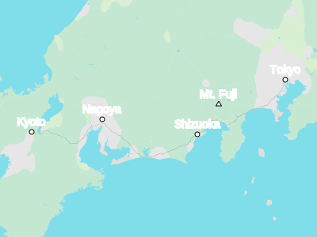

SVG Map Builder
==

Build SVG maps from GeoJSON or vector tile data.

Simple maps used as illustrations shouldn't require a large client library and hosting for image or vector data tiles.

This project offers a library for building SVG map images with an API similar to web mapping libraries, but can be used to render maps offline (such as during a build step), on the server, or on the client.

Example
--

See how this map was built in [packages/example](packages/example).

Map data from [OpenStreetMap](https://www.openstreetmap.org/copyright).

API notes
--

A map image consists of _layers_, layers can reference data _sources_, layers determine how to draw vector data provided by a data source. 

Examples of layers: a _background_ layer generates a `<rect>` element covering the world; a _path_ layer generates `<path>` elements from geometry; a _marker_ layer places `<text>` elements and icons.

A _layout_ defines the conversion from world coordinates to canvas coordinates and the map image dimensions.

The _camera layout_ is defined by center, zoom, and image dimensions. The _box layout_ is defined by a geometry bounds in world coordinates, image dimensions, and padding in canvas coordinates; it fits the geometry to the image dimensions with the requested padding.

Data sources are addressed by tile identifier; they provide tiles which contain features with properties and geometry.

The API concepts are intended to be similar at a high level to the [MapLibre style spec](https://maplibre.org/maplibre-style-spec/) but with an emphasis on rendering SVG images.

Some ideas this project uses
--

Vector tiles are drawn using nested `<svg>` elements, with the geometry using the coordinates in the tile.

Emphasizes graphics coordinates, so it doesn't do any projection (except utility routines for converting to to web mercator).

Other than tile coordinates, it deals in _world coordinates,_ where the world is a square with 0,0 at the northwest and 1,1 at the southeast, and _canvas coordinates,_ the coordinate system in the outermost `<svg>` element.

See also:

- [geojson-vt](https://github.com/mapbox/geojson-vt)
- [PMTiles Concepts](https://docs.protomaps.com/pmtiles/)
- [Slippy map tilenames](https://wiki.openstreetmap.org/wiki/Slippy_map_tilenames)
- [Vector tiles standards](https://docs.mapbox.com/data/tilesets/guides/vector-tiles-standards/)

Status
--

This is pre-release software.

Some current limitations include:

- No label placement for polygon or linestring geometry (only points).

- No way to measure label text size, so removing overlapping labels needs to be done with JavaScript when displaying the map image, or by pessimistically choosing labels that will work for the desired image size.

- Different tradeoffs from image tiles or WebGPU/WebGL rendering:
  - Simpler text implementation: it just relies on the browser's SVG text rendering. On the other hand, it doesn't currently offer more advanced layout and label placement.
  - Line rendering relies on the `vector-effect` attribute.
  - ...

